> Generated by /vibe:docs — manual edits will be overwritten; use README for hand-written content.

# Architecture

`mode-quick-versus` is a static, no-backend TypeScript/Vite app. It consumes the `character`, `stage`, `sff`, and `engine` OpenKakutou libraries as client-side WebAssembly modules — no Go toolchain, no server.

## Modules

- **`src/wasm/`** — one bridge file per WASM dependency, each an independent Go program with its own runtime instance:
  - `bridge.ts` — the bridge to the `character` WASM module. Loads `wasm_exec.js` and `character.wasm` (downloaded via `scripts/download-wasm.mjs`, gitignored under `public/wasm/`), and exposes typed `loadCharacter()` (name, animations, sprite metadata, and combat state defs) and `resolveSprites()` (batched, on-demand decoded pixel data for a set of sprite references) — never throwing.
  - `stage-bridge.ts` — the equivalent bridge to the `stage` WASM module. Loads its own `stage-wasm_exec.js` and `stage.wasm` (downloaded separately, see below) and exposes typed `loadStage()` (name, stage-level settings, BG elements/layers, animation blocks, movement boundaries), `resolveSprites()`, and `resolveAnimationFrames()` (which sprite an animated BG element currently shows). Kept as a separate `wasm_exec.js` file on disk from `character`'s own, since the two WASM modules are released independently and are not guaranteed to share the exact same Go toolchain version.
  - `engine-bridge.ts` — the bridge to the `engine` WASM module (combat simulation), with its own `engine-wasm_exec.js`/`engine.wasm`, same independent-runtime-instance pattern. Exposes `newMatch()`, `tick()`, and `closeMatch()`, each taking/returning one JSON-encoded request/response rather than typed arguments — a different call shape from `character`'s/`stage`'s own bridges, so this bridge also owns the JSON encode/decode at the boundary. `engine` has no published WASM release yet (unlike `character`/`stage`), see "Local setup" below.
- **`src/roster/`** — turns the deploy-time roster manifest into the actual displayable roster.
  - `manifest.ts` fetches and validates `public/roster-manifest.json` at runtime (not compiled into the JS bundle), so a deployment can change the roster without a rebuild.
  - `discovery.ts` fetches each manifest entry's character files and validates them through the WASM bridge, resolving every entry independently — one character's failure never affects another's.
- **`src/stage/`** — the same shape as `src/roster/`, for the stage list instead of the character roster.
  - `manifest.ts` fetches and validates `public/stage-manifest.json` at runtime.
  - `discovery.ts` fetches each manifest entry's `.def` file and validates it through the `stage` WASM bridge, resolving every entry independently.
- **`src/selection/`** — one rendering module per screen:
  - `roster-screen.ts` renders the roster grid and the two independent Player 1 / Player 2 selection controls, gating a "Continue" action on both players having picked.
  - `stage-screen.ts` renders the stage grid as a single-choice `role="radiogroup"`, since (unlike character selection) both players share one stage — picking a new stage deselects the previous one, and Continue is gated on exactly one stage being chosen.
- **`src/setup/`** — `setup-screen.ts` renders the match setup screen once a stage is chosen: two independent `role="radiogroup"` sections, one for round count and one for time limit, each with its own heading wired via `aria-labelledby` so the two groups stay unambiguous. Continue is gated on both groups having a selection, checked independently, so switching one never resets the other. "Unlimited" is a first-class tagged value in the same option type as the numeric second values, never a numeric sentinel. A misconfigured option set (an even round count, a non-positive time limit) renders a blocking, named error state instead of a default/fallback selection — see `.vibe/decisions/003-match-setup-screen-design.md`.
- **`src/rendering/`** — the match scene itself, once setup is confirmed:
  - `match-config.ts` — pure assembly logic turning already-loaded character/stage data and the setup screen's config into an `engine` `newMatch` request (combat state defs keyed by number, starting positions/facing symmetric around the stage center, stage movement boundaries with a fallback when a stage leaves them unset).
  - `animation-resolution.ts` — pure logic resolving which `.air` frame is currently showing for a given animation number and elapsed ticks, mirroring `engine`'s own internal algorithm (since `engine` reports the elapsed time but not a resolved frame index).
  - `scene-composition.ts` — pure logic for coordinate mapping, sprite placement (axis/pivot, facing and frame mirroring), stage layer draw order (behind/in front of the characters), and placeholder fallback for an unresolvable sprite reference.
  - `sprite-pixel-cache.ts` — decodes a given sprite reference at most once per match session, never re-requesting it once resolved (or once known to have failed).
  - `tick-scheduling.ts` — pure fixed-timestep accounting: how many simulation ticks a render frame should run, capped so a long gap (e.g. a backgrounded browser tab) resyncs rather than freezing to catch up.
  - `match-renderer.ts` — ties the above together: starts a match via the `engine` bridge, resolves the sprites needed to draw its current state (cached), and drives the tick loop that keeps the canvas in sync with the simulation. Shows a brief loading status while the match starts, then the canvas.
- **`src/main.ts`** — the composition root: builds the `web-ui-kit` app shell, then chains manifest fetch → discovery → selection screen for the character roster, followed by the same pipeline for the stage list once both players have picked, then the match setup screen once a stage is chosen, then — once setup is confirmed — re-fetches both players' character files and the chosen stage's file and starts match rendering.

## Data flow

```mermaid
flowchart LR
    manifest["public/roster-manifest.json"] --> fetchManifest["roster/manifest.ts\nfetchRosterManifest"]
    fetchManifest --> discover["roster/discovery.ts\ndiscoverRoster"]
    wasmBridge["wasm/bridge.ts\nloadCharacter"] --> discover
    charWasm["character.wasm"] --> wasmBridge
    discover --> screen["selection/roster-screen.ts\nrenderRosterScreen"]
    screen -->|"onContinue(p1Id, p2Id)"| stageManifest["stage/manifest.ts\nfetchStageManifest"]
    stageManifest --> stageDiscover["stage/discovery.ts\ndiscoverStages"]
    stageWasmBridge["wasm/stage-bridge.ts\nloadStage"] --> stageDiscover
    stageWasm["stage.wasm"] --> stageWasmBridge
    stageDiscover --> stageScreen["selection/stage-screen.ts\nrenderStageScreen"]
    stageScreen -->|"onContinue(stageId)"| setupScreen["setup/setup-screen.ts\nrenderSetupScreen"]
    setupScreen -->|"onContinue(config)"| startMatch["main.ts startMatch"]
    startMatch --> renderMatch["rendering/match-renderer.ts\nrenderMatch"]
    engineWasmBridge["wasm/engine-bridge.ts\nnewMatch / tick"] --> renderMatch
    engineWasm["engine.wasm"] --> engineWasmBridge
    renderMatch --> canvas["match scene canvas"]
```

Every external effect (`fetch`, the WASM instantiation, `requestAnimationFrame`) is injected as a parameter with a real default — `wasm/bridge.ts`'s, `wasm/stage-bridge.ts`'s, and `wasm/engine-bridge.ts`'s own `fetchWasmExecSource`/`fetchWasmBytes`, `roster/manifest.ts`'s and `stage/manifest.ts`'s `fetchManifestSource`, `roster/discovery.ts`'s and `stage/discovery.ts`'s `fetchBytes`/loader, `rendering/match-renderer.ts`'s own bridge/draw/timing functions — so every layer is testable under Vitest/jsdom without a running dev server, and `main.ts`'s own tests inject fakes to test its wiring without touching any real WASM module.

## Roster and stage manifests

Neither list is hardcoded into the app: `public/roster-manifest.json` and `public/stage-manifest.json` are both fetched at runtime and list each entry's file paths and a static portrait image path. Both committed defaults ship as an empty array (`[]`); a real deployment overwrites these files with the actual roster/stage list at deploy time. The stage manifest lists only a stage's `.def` path — its `.sff` sprite sheet path is instead read out of the loaded stage's own `[BGDef]` data and resolved by basename against the `.def`'s own directory.

## Local setup

Beyond `npm install`, a working dev environment needs the `character` and `stage` WASM builds downloaded once (see README's Installation section — `npm run wasm:download -- <version>` and `npm run wasm:download:stage -- <version>`), since `src/wasm/bridge.ts` and `src/wasm/stage-bridge.ts` load them from `public/wasm/` (gitignored, never committed). `src/wasm/engine-bridge.ts` needs `engine.wasm`/`engine-wasm_exec.js` the same way — `npm run wasm:download:engine -- <version>` is wired up for when a published `engine` release exists, but as of this writing `engine` has no release with build assets attached yet, so `engine.wasm` currently has to be built locally from a sibling `engine` checkout (`GOOS=js GOARCH=wasm go build -o engine.wasm ./cmd/wasm`) and copied into `public/wasm/` by hand.
