> Generated by /vibe:docs — manual edits will be overwritten; use README for hand-written content.

# Architecture

`mode-quick-versus` is a static, no-backend TypeScript/Vite app. It consumes the `character`, `stage`, `sff`, and `engine` OpenKakutou libraries as client-side WebAssembly modules — no Go toolchain, no server.

## Modules

- **`src/wasm/`** — one bridge file per WASM dependency, each an independent Go program with its own runtime instance:
  - `bridge.ts` — the bridge to the `character` WASM module. Loads `wasm_exec.js` and `character.wasm` (downloaded via `scripts/download-wasm.mjs`, gitignored under `public/wasm/`), and exposes typed `loadCharacter()` (name, animations, sprite metadata, and combat state defs), `loadCmd()` (a character's own `.cmd` input command file, parsed and typed), and `resolveSprites()` (batched, on-demand decoded pixel data for a set of sprite references) — never throwing.
  - `stage-bridge.ts` — the equivalent bridge to the `stage` WASM module. Loads its own `stage-wasm_exec.js` and `stage.wasm` (downloaded separately, see below) and exposes typed `loadStage()` (name, stage-level settings, BG elements/layers, animation blocks, movement boundaries), `resolveSprites()`, and `resolveAnimationFrames()` (which sprite an animated BG element currently shows). Kept as a separate `wasm_exec.js` file on disk from `character`'s own, since the two WASM modules are released independently and are not guaranteed to share the exact same Go toolchain version.
  - `engine-bridge.ts` — the bridge to the `engine` WASM module (combat simulation), with its own `engine-wasm_exec.js`/`engine.wasm`, same independent-runtime-instance pattern. Exposes `newMatch()`, `tick()`, `resetRound()` (backlog item 007: advances a decided round to a fresh next round — health/position restored, the next round number computed by the session itself), and `closeMatch()`, each taking/returning one JSON-encoded request/response rather than typed arguments — a different call shape from `character`'s/`stage`'s own bridges, so this bridge also owns the JSON encode/decode at the boundary. `engine` has no published WASM release yet (unlike `character`/`stage`), see "Local setup" below.
  - All three bridges genuinely never throw (backlog item 008): a missing or version-mismatched `.wasm`/`wasm_exec.js` asset — a 404, a network failure, a corrupt or incompatible binary `WebAssembly.instantiate` rejects — is caught at runtime-instantiation time and returned as the same typed `{ok:false, error}` result every other bridge failure already uses, instead of becoming an unhandled promise rejection. Every calling screen (roster/stage discovery, match start) already renders that `error` as a visible message, so this closes what would otherwise be a blank-page/silent-failure gap in production.
- **`src/roster/`** — turns the deploy-time roster manifest into the actual displayable roster.
  - `manifest.ts` fetches and validates `public/roster-manifest.json` at runtime (not compiled into the JS bundle), so a deployment can change the roster without a rebuild.
  - `discovery.ts` fetches each manifest entry's character files and validates them through the WASM bridge, resolving every entry independently — one character's failure never affects another's.
- **`src/stage/`** — the same shape as `src/roster/`, for the stage list instead of the character roster.
  - `manifest.ts` fetches and validates `public/stage-manifest.json` at runtime.
  - `discovery.ts` fetches each manifest entry's `.def` file and validates it through the `stage` WASM bridge, resolving every entry independently.
- **`src/selection/`** — one rendering module per screen:
  - `roster-screen.ts` renders the roster grid and the two independent Player 1 / Player 2 selection controls, gating a "Continue" action on both players having picked.
  - `stage-screen.ts` renders the stage grid as a single-choice `role="radiogroup"`, since (unlike character selection) both players share one stage — picking a new stage deselects the previous one, and Continue is gated on exactly one stage being chosen.
- **`src/setup/`** — `setup-screen.ts` renders the match setup screen once a stage is chosen: three independent `role="radiogroup"` sections — round count, time limit, and (backlog item 007) Player 2 Control (Human or CPU) — each with its own heading wired via `aria-labelledby` so the groups stay unambiguous. Continue is gated on the round count and time limit both having a selection, checked independently, so switching one never resets the other; Player 2 Control is pre-selected to Human by default, so it never adds friction to the existing two-human flow. "Unlimited" is a first-class tagged value in the same option type as the numeric second values, never a numeric sentinel. A misconfigured option set (an even round count, a non-positive time limit) renders a blocking, named error state instead of a default/fallback selection — see `.vibe/decisions/003-match-setup-screen-design.md`. The screen also renders a read-only Controls section listing both players' default keyboard bindings and a note about gamepad support, sourced from `src/input/key-bindings.ts` — player 2's own listing swaps to a "controlled automatically" note instead once CPU is selected.
- **`src/input/`** — live keyboard/gamepad input, routed into `engine`'s per-tick simulation:
  - `key-bindings.ts` — the default keyboard bindings for both players (spatially separate keyboard regions so two players can share one keyboard) and the standard Gamepad API button index each of the six MUGEN/Ikemen-GO button names (`a b c x y z`) reads from.
  - `keyboard-input.ts` — tracks both players' held keys live via `window` `keydown`/`keyup` listeners, clearing all held keys on `blur` (e.g. alt-tab) so a key can never appear stuck "held".
  - `gamepad-input.ts` — polls the Gamepad API once per call and assigns connected gamepads to players by connection order; a player whose gamepad disconnects reads back as "no gamepad" on the very next poll, never a stuck button.
  - `tick-input-source.ts` — combines the two: each player's assigned gamepad if still connected, otherwise their keyboard bindings, never merged. Polled once per rendered frame and reused for every simulation tick that frame's fixed-timestep loop runs, keeping the tick hot path allocation-free.
- **`src/rendering/`** — the match scene itself, once setup is confirmed:
  - `match-config.ts` — pure assembly logic turning already-loaded character/stage data, each player's own parsed `.cmd` command file, and the setup screen's config into an `engine` `newMatch` request (combat state defs keyed by number, starting positions/facing symmetric around the stage center, stage movement boundaries with a fallback when a stage leaves them unset). A fighter whose `.cmd` file couldn't be loaded falls back to an empty command file rather than blocking the match.
  - `animation-resolution.ts` — pure logic resolving which `.air` frame is currently showing for a given animation number and elapsed ticks, mirroring `engine`'s own internal algorithm (since `engine` reports the elapsed time but not a resolved frame index).
  - `scene-composition.ts` — pure logic for coordinate mapping, sprite placement (axis/pivot, facing and frame mirroring), stage layer draw order (behind/in front of the characters), and placeholder fallback for an unresolvable sprite reference.
  - `sprite-pixel-cache.ts` — decodes a given sprite reference at most once per match session, never re-requesting it once resolved (or once known to have failed).
  - `tick-scheduling.ts` — pure fixed-timestep accounting: how many simulation ticks a render frame should run, capped so a long gap (e.g. a backgrounded browser tab) resyncs rather than freezing to catch up.
  - `match-renderer.ts` — ties the above together: starts a match via the `engine` bridge, resolves the sprites needed to draw its current state (cached), reads live input once per frame from `src/input/tick-input-source.ts` (or, when player 2 is CPU-controlled, from `src/cpu/cpu-input-source.ts`'s wrapper around it) and threads it into the simulation, and drives the tick loop that keeps the canvas in sync. Shows a brief loading status while the match starts, then the HUD, the canvas, a live status line naming each player's current input source (keyboard or gamepad), and (backlog item 007) the round/match result overlay. The instant a tick reports a decided round, the loop stops calling `tick()` — even mid catch-up-burst, never finishing that frame's remaining ticks, since a repeated call would double-count the win — draws/updates the HUD one final time so the deciding frame is what freezes on screen, then shows the round result (auto-advancing to the next round via `resetRound()` once its countdown completes) or, if the match is also over, the match result instead, with its own Rematch (restarts the exact same match by calling itself again on the same root) and Back to select (stops the match, then calls the caller-supplied `onBackToSelect`) actions.
- **`src/result/`** — the round/match result overlay (backlog item 007):
  - `outcome.ts` — pure derivation of a clear "who won" result from `engine`'s raw round/match outcome codes: a KO or timeout resolves to the reported winner, a double KO or a timeout-at-equal-health resolves to a draw, and (defensively) an outcome code or winner side `engine` isn't documented to produce also degrades to a draw rather than leaving the result undefined.
  - `result-screen.ts` — builds the overlay once and mutates it in place: a round result shows the winner (or a draw) with a visible, non-`aria-live` countdown that auto-advances after a fixed delay (a round result isn't a decision, so no button is asked for); a match result shows the winner (or a draw) with explicit Rematch/Back to select actions and no countdown. The one-shot outcome line is announced via its own `aria-live` region; the countdown text deliberately is not, so it never re-announces once per second.
- **`src/cpu/`** — the minimal, first-pass CPU opponent for player 2 (backlog item 007):
  - `cpu-controller.ts` — pure, stateless decision logic: walks toward the opponent when far, may attempt an attack once in range (a small per-tick chance, not a held button), and degrades to a fully neutral input on malformed position data. Mutates a caller-supplied input object in place rather than allocating a fresh one each tick.
  - `cpu-input-source.ts` — composes the CPU controller with the existing input-source abstraction rather than bypassing it: wraps a real `TickInputSource`, leaves player 1's input exactly as produced, and overwrites player 2's in place using the controller's decision, fed a live fighter-position snapshot via a closure supplied at construction time (not a change to `TickInputSource.read()`'s own signature).
- **`src/hud/`** — the in-match HUD, built once when a match starts and updated once per rendered frame that also simulates (never once per tick during a multi-tick catch-up burst):
  - `hud-view-model.ts` — pure validation/derivation of a HUD view model (each fighter's health/power as a clamped percentage, the round number, each player's round wins, the best-of) from `engine`'s raw match state and progress, treated as untrusted data rather than assumed to already match its declared shape. Any missing, wrong-typed, or out-of-range field (a negative health, a non-numeric power) fails the whole derivation as one error — never a partially-valid result.
  - `hud-renderer.ts` — builds the HUD's DOM once (each bar a `role="progressbar"` with its own real health/power range, not a hardcoded percentage) and mutates it in place on every update — no rebuilding. A derivation error swaps the whole HUD into one labeled error message instead of a broken or frozen bar, without affecting match simulation or canvas rendering at all. A round-number or win-count change announces once via `aria-live`; an ordinary health/power-only update never does, to avoid flooding assistive tech every simulation tick.
- **`src/i18n/`** — localization: `i18n.ts` wires `web-ui-kit`'s shared i18next integration layer under this app's own namespace (`"mode-quick-versus"`) and its own `localStorage` key, plus a `t(key, defaultValue, vars?)` wrapper that falls back to the interpolated `defaultValue` before i18n has initialized (e.g. in a test rendering a screen directly). `en.json`/`fr.json` hold this app's own message catalogs for the roster, stage, and setup screens.
- **`src/main.ts`** — the composition root: builds the `web-ui-kit` app shell (including a `<wuik-locale-switcher>` in the toolbar), then shows the character roster (its own `showRosterSelection` helper: manifest fetch → discovery → selection screen), followed by the same pipeline for the stage list once both players have picked, then the match setup screen once a stage is chosen, then — once setup is confirmed — re-fetches both players' character files (including their `.cmd` command file) and the chosen stage's file, threads the setup screen's CPU-opponent choice through, and starts match rendering. `showRosterSelection` is re-invoked, fresh, as the match result screen's own "back to select" action (backlog item 007) — re-fetching rather than threading the already-discovered roster down through every intermediate screen function, since backing out of a match is a rare, deliberate action, not a hot path.

## Data flow

```mermaid
flowchart LR
    manifest["public/roster-manifest.json"] --> fetchManifest["roster/manifest.ts\nfetchRosterManifest"]
    fetchManifest --> discover["roster/discovery.ts\ndiscoverRoster"]
    wasmBridge["wasm/bridge.ts\nloadCharacter"] --> discover
    charWasm["character.wasm"] --> wasmBridge
    discover --> screen["selection/roster-screen.ts\nrenderRosterScreen"]
    screen -->|"onContinue(p1Id, p2Id)"| stageManifest["stage/manifest.ts\nfetchStageManifest"]
    stageManifest --> stageDiscover["stage/discovery.ts\ndiscoverStages"]
    stageWasmBridge["wasm/stage-bridge.ts\nloadStage"] --> stageDiscover
    stageWasm["stage.wasm"] --> stageWasmBridge
    stageDiscover --> stageScreen["selection/stage-screen.ts\nrenderStageScreen"]
    stageScreen -->|"onContinue(stageId)"| setupScreen["setup/setup-screen.ts\nrenderSetupScreen"]
    setupScreen -->|"onContinue(config)"| startMatch["main.ts startMatch"]
    startMatch --> renderMatch["rendering/match-renderer.ts\nrenderMatch"]
    engineWasmBridge["wasm/engine-bridge.ts\nnewMatch / tick / resetRound"] --> renderMatch
    engineWasm["engine.wasm"] --> engineWasmBridge
    inputSource["input/tick-input-source.ts\nread() once per frame"] --> cpuWrap
    cpuWrap["cpu/cpu-input-source.ts + cpu-controller.ts\n(player 2 = CPU only)"] --> renderMatch
    keyboard["input/keyboard-input.ts"] --> inputSource
    gamepad["input/gamepad-input.ts"] --> inputSource
    renderMatch --> canvas["match scene canvas"]
    renderMatch -->|"state, progress (per simulated frame)"| hud["hud/hud-renderer.ts\ncreateHud().update()"]
    hudViewModel["hud/hud-view-model.ts\nderiveHudViewModel"] --> hud
    renderMatch -->|"round.outcome != none"| outcome["result/outcome.ts\nderiveRoundOutcome / deriveMatchOutcome"]
    outcome --> resultOverlay["result/result-screen.ts\ncreateResultOverlay"]
    resultOverlay -->|"onRoundResultDone"| engineWasmBridge
    resultOverlay -->|"onRematch"| renderMatch
    resultOverlay -->|"onBackToSelect"| showRosterSelection["main.ts\nshowRosterSelection"]
    showRosterSelection --> screen
```

Every external effect (`fetch`, the WASM instantiation, `requestAnimationFrame`, keyboard/gamepad listeners, timers) is injected as a parameter with a real default — `wasm/bridge.ts`'s, `wasm/stage-bridge.ts`'s, and `wasm/engine-bridge.ts`'s own `fetchWasmExecSource`/`fetchWasmBytes`, `roster/manifest.ts`'s and `stage/manifest.ts`'s `fetchManifestSource`, `roster/discovery.ts`'s and `stage/discovery.ts`'s `fetchBytes`/loader, `rendering/match-renderer.ts`'s own bridge/draw/timing/input-source/result-overlay functions — so every layer is testable under Vitest/jsdom without a running dev server, and `main.ts`'s own tests inject fakes to test its wiring without touching any real WASM module.

## Roster and stage manifests

Neither list is hardcoded into the app: `public/roster-manifest.json` and `public/stage-manifest.json` are both fetched at runtime and list each entry's file paths and a static portrait image path. A roster entry lists all five of a character's files — `.def`, `.air`, `.sff`, `.cns`, and `.cmd` (the input command file routed player input resolves against). Both committed defaults ship as an empty array (`[]`); a real deployment overwrites these files with the actual roster/stage list at deploy time. The stage manifest lists only a stage's `.def` path — its `.sff` sprite sheet path is instead read out of the loaded stage's own `[BGDef]` data and resolved by basename against the `.def`'s own directory.

## Localization

The roster, stage, and setup screens hold in-progress, not-yet-submitted user selections (both players' character picks, the chosen stage, the chosen round count/time limit) in local closures. Each screen subscribes to a locale-change notification internally and re-translates only its already-rendered text in place — never rebuilding its DOM — so switching language mid-screen never resets a player's current pick. `main.ts`'s own transient one-line status text (shown briefly between screens while a manifest or match asset fetch is in flight) is translated at the moment it is shown, but not wired to retranslate live, since it holds no state and isn't one of the three screens above. See `.vibe/decisions/006-i18n-integration-approach.md` for the full rationale, including why the round option label reads "Rounds: 3" rather than a pluralized "3 Rounds".

## Local setup

Beyond `npm install`, a working dev environment needs the `character`, `stage`, and `engine` WASM builds downloaded once (see README's Installation section — `npm run wasm:download -- <version>`, `npm run wasm:download:stage -- <version>`, and `npm run wasm:download:engine -- <version>`), since `src/wasm/bridge.ts`, `src/wasm/stage-bridge.ts`, and `src/wasm/engine-bridge.ts` all load their own `.wasm`/`wasm_exec.js` pair from `public/wasm/` (gitignored, never committed). All three now have published releases with build assets attached — `engine` did not for a while (tracked in `.vibe/decisions/004-match-rendering-architecture.md`), but its release pipeline has since shipped one, so building it locally from a sibling checkout is no longer needed.
