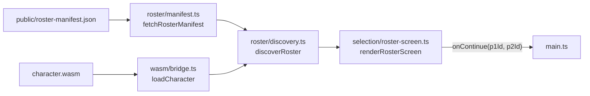

> Generated by /vibe:docs — manual edits will be overwritten; use README for hand-written content.

# Architecture

`mode-quick-versus` is a static, no-backend TypeScript/Vite app. It consumes the `character`, `stage`, `sff`, and `engine` OpenKakutou libraries as client-side WebAssembly modules — no Go toolchain, no server.

## Modules

- **`src/wasm/`** — the bridge to the `character` WASM module. Loads `wasm_exec.js` and `character.wasm` (downloaded via `scripts/download-wasm.mjs`, gitignored under `public/wasm/`), and exposes a typed `loadCharacter()` returning either the character's name or a descriptive error — never throwing. See `src/wasm/bridge.ts`.
- **`src/roster/`** — turns the deploy-time roster manifest into the actual displayable roster.
  - `manifest.ts` fetches and validates `public/roster-manifest.json` at runtime (not compiled into the JS bundle), so a deployment can change the roster without a rebuild.
  - `discovery.ts` fetches each manifest entry's character files and validates them through the WASM bridge, resolving every entry independently — one character's failure never affects another's.
- **`src/selection/`** — `roster-screen.ts` renders the roster grid and the two independent Player 1 / Player 2 selection controls, gating a "Continue" action on both players having picked.
- **`src/main.ts`** — the composition root: builds the `web-ui-kit` app shell, wires the manifest fetch → discovery → selection screen pipeline, and shows the confirmed picks once both players are ready.

## Data flow

Every external effect (`fetch`, the WASM instantiation) is injected as a parameter with a real default — `wasm/bridge.ts`'s `fetchWasmExecSource`/`fetchWasmBytes`, `roster/manifest.ts`'s `fetchManifestSource`, `roster/discovery.ts`'s `fetchBytes`/`loadCharacter` — so every layer is testable under Vitest/jsdom without a running dev server, and `main.ts`'s own tests inject a fake `loadCharacter` to test its wiring without touching the real WASM module at all.

## Roster manifest

The roster is not hardcoded into the app: `public/roster-manifest.json` is fetched at runtime and lists each character's file paths and a static portrait image path. The committed default ships as an empty array (`[]`); a real deployment overwrites this file with the actual roster at deploy time.

## Local setup

Beyond `npm install`, a working dev environment needs the `character` WASM build downloaded once (see README's Installation section — `npm run wasm:download -- <version>`), since `src/wasm/bridge.ts` loads it from `public/wasm/` (gitignored, never committed).
