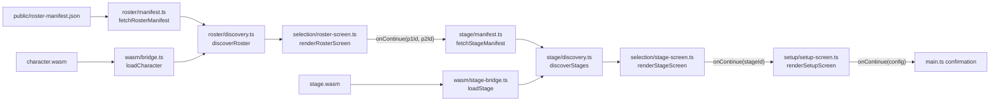

> Generated by /vibe:docs — manual edits will be overwritten; use README for hand-written content.

# Architecture

`mode-quick-versus` is a static, no-backend TypeScript/Vite app. It consumes the `character`, `stage`, `sff`, and `engine` OpenKakutou libraries as client-side WebAssembly modules — no Go toolchain, no server.

## Modules

- **`src/wasm/`** — one bridge file per WASM dependency, each an independent Go program with its own runtime instance:
  - `bridge.ts` — the bridge to the `character` WASM module. Loads `wasm_exec.js` and `character.wasm` (downloaded via `scripts/download-wasm.mjs`, gitignored under `public/wasm/`), and exposes a typed `loadCharacter()` returning either the character's name or a descriptive error — never throwing.
  - `stage-bridge.ts` — the equivalent bridge to the `stage` WASM module. Loads its own `stage-wasm_exec.js` and `stage.wasm` (downloaded separately, see below) and exposes a typed `loadStage()`. Kept as a separate `wasm_exec.js` file on disk from `character`'s own, since the two WASM modules are released independently and are not guaranteed to share the exact same Go toolchain version.
- **`src/roster/`** — turns the deploy-time roster manifest into the actual displayable roster.
  - `manifest.ts` fetches and validates `public/roster-manifest.json` at runtime (not compiled into the JS bundle), so a deployment can change the roster without a rebuild.
  - `discovery.ts` fetches each manifest entry's character files and validates them through the WASM bridge, resolving every entry independently — one character's failure never affects another's.
- **`src/stage/`** — the same shape as `src/roster/`, for the stage list instead of the character roster.
  - `manifest.ts` fetches and validates `public/stage-manifest.json` at runtime.
  - `discovery.ts` fetches each manifest entry's `.def` file and validates it through the `stage` WASM bridge, resolving every entry independently.
- **`src/selection/`** — one rendering module per screen:
  - `roster-screen.ts` renders the roster grid and the two independent Player 1 / Player 2 selection controls, gating a "Continue" action on both players having picked.
  - `stage-screen.ts` renders the stage grid as a single-choice `role="radiogroup"`, since (unlike character selection) both players share one stage — picking a new stage deselects the previous one, and Continue is gated on exactly one stage being chosen.
- **`src/setup/`** — `setup-screen.ts` renders the match setup screen once a stage is chosen: two independent `role="radiogroup"` sections, one for round count and one for time limit, each with its own heading wired via `aria-labelledby` so the two groups stay unambiguous. Continue is gated on both groups having a selection, checked independently, so switching one never resets the other. "Unlimited" is a first-class tagged value in the same option type as the numeric second values, never a numeric sentinel. A misconfigured option set (an even round count, a non-positive time limit) renders a blocking, named error state instead of a default/fallback selection — see `.vibe/decisions/003-match-setup-screen-design.md`.
- **`src/main.ts`** — the composition root: builds the `web-ui-kit` app shell, then chains manifest fetch → discovery → selection screen for the character roster, followed by the same pipeline for the stage list once both players have picked, then the match setup screen once a stage is chosen, and shows the confirmed picks (both players' characters, the chosen stage, and the configured rounds/time limit) once the whole flow completes.

## Data flow

Every external effect (`fetch`, the WASM instantiation) is injected as a parameter with a real default — `wasm/bridge.ts`'s and `wasm/stage-bridge.ts`'s own `fetchWasmExecSource`/`fetchWasmBytes`, `roster/manifest.ts`'s and `stage/manifest.ts`'s `fetchManifestSource`, `roster/discovery.ts`'s and `stage/discovery.ts`'s `fetchBytes`/loader — so every layer is testable under Vitest/jsdom without a running dev server, and `main.ts`'s own tests inject fake `loadCharacter`/`loadStage` to test its wiring without touching either real WASM module.

## Roster and stage manifests

Neither list is hardcoded into the app: `public/roster-manifest.json` and `public/stage-manifest.json` are both fetched at runtime and list each entry's file paths and a static portrait image path. Both committed defaults ship as an empty array (`[]`); a real deployment overwrites these files with the actual roster/stage list at deploy time.

## Local setup

Beyond `npm install`, a working dev environment needs both the `character` and `stage` WASM builds downloaded once (see README's Installation section — `npm run wasm:download -- <version>` and `npm run wasm:download:stage -- <version>`), since `src/wasm/bridge.ts` and `src/wasm/stage-bridge.ts` load them from `public/wasm/` (gitignored, never committed).
